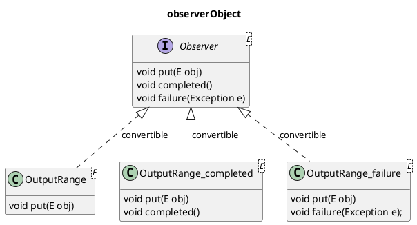

# rxについて
rxは、`Reactive Extensions`と呼ばれる非同期処理のためのライブラリのD言語向け実装です。

`Reactive Extensions`自体は多様な言語で実装されており、多くの考え方や名前はそれらを参考としています。
しかし、言語特有の命名規則や慣例も重視しているため、関数や各種オペレーターの名前の多くはD言語の標準ライブラリに近い構成となっています。

以下では、このrxの基本となるコンセプトや型の定義、基本的な扱いについて説明します。

また、より具体的な利用方法が知りたい場合、「実践編（Practice.ja.md）」を用意していますのでそちらも参照してください。

> Note: 文書中の図を正しく表示するためには**PlantUML**が必要です。

## 基本となる型とイディオム
rxで重要となるのは、「Observable」「Observer」「Disposable」「Scheduler」という4つのコンセプトと、実用のためにそれらから派生する「Subject」という型です。

また、合わせて提供される「型チェックテンプレート」「共通インターフェース」「ラップ関数」といった普遍的なイディオム、`doSubscribe`という購読のための汎用関数、それらの簡単な利用方法についても説明します。

## Observable
`Observable`は`rx.observable`というモジュールで定義されているコンセプトです。
これは、「非同期で複数の値を送り出す生成元を抽象化したもの」と表現することができます。

たとえば、GUIアプリにおけるクリックやマウスの移動など、複数回発生しうるイベントを抽象化して扱うことができます。
仮にこれらを定義するとすれば`Observable!MouseEvent`のような表現になるでしょう。

この`Observable`には、`subscribe`というメソッドで「発生した値に対する処理」を登録する機能があります。
これによって発生した値に対する処理を統一的に書くことができます。

> （補足）コンセプトについて
>
> ここで言う「コンセプト」は、D言語の特徴でもある`Range`という「概念」になぞらえたものです。
> `Range`は一定の要件を定め、様々な型が同様の名前やシグネチャを持ったインターフェースを提供することで実現されています。
> この`Observable`もそれと同様に一定のインターフェースを定義し、それによって様々な型を`Observable`として扱えるようにします。


### 要件・型チェックテンプレート
この`Observable`というコンセプトは、その要件を確かめるために`isObservable`という「型チェックテンプレート」を提供します。
これは、`std.range`で定義された`InputRange`コンセプトに対する`isInputRange`テンプレートに相当します。

`isObservable`は、具体的には`template isObservable(T, E)`として定義されるテンプレートで、「与えられた型`T`が型`E`の`Observable`かどうか」を静的にチェックすることができます。

このとき確かめる`Observable`の要件は以下の3つです。

1. `T.ElementType`で送出する値の型が取得できる
2. `subscribe`メソッドを持ち、`Observer!E`を引数として呼び出すことができる
3. 2で呼び出したメソッドの戻り値が`Disposable`として扱える

ここで出てくる`Observer!E`や`Disposable`については、別のコンセプトとして後述します。

また、これを簡便化した`template isObservable(T)`というテンプレートも提供します。
これは`isObservable!(T, T.ElementType)`として記述した場合と同様の結果を返します。

#### チェック内容

たとえば、`isObservable!(T, int)`は、型`T`が`int`の値を送出する`Observable`であるかどうかをチェックしますが、これを具体的にコードにすると以下のようなチェックになります。

```d
T observable;

static assert(is(T.ElementType == int)); // check 1

Observer!int observer;
auto disposable = observable.subscribe(observer); // check 2

static assert(isDisposable!(typeof(disposable))); // check 3
```

#### 利用方法
`isObservable`テンプレートは、「型が何らかの`Observable`であること」または「型が一定の型を送出する`Observable`であること」をチェックします。

これは主に、テンプレート化した関数を定義したとき「引数が必要な型を送出する`Observable`であるかどうか」をチェックするために使われます。

たとえば、一定時間ごとに現在時刻の`TimeOfDay`を送出する時計のような`Observable`だけを受け付けたいとき、それをチェックするには以下のような記述を行います。

```d
void registerClock(TObservable)(TObservable clock)
if (isObservable!(TObservable, TimeOfDay))
{
    // to process
}
```

### 共通インターフェース、ラップ関数
`Observable`なオブジェクトは、要件さえ満たしていれば構造体やクラスなど様々な形式で定義することができます。
これは、より具体的な型のほうが最適化が可能であるなどのメリットがあり、非常に重要なポイントでもあります。

しかし、様々な型が提供される一方で、その`Observable`を扱う側、特に様々な`Observable`なオブジェクトを一定のフィールドに保持したり、配列で管理するようなロジックの実装は難しくなります。

この課題を解決するため、コンセプト名に対応した`Observable`という「共通インターフェース」、これを構築するための`observableObject`という「ラップ関数」の2つを提供します。

これらの具体的な定義は以下の通りです。

```d
interface Observable(E)
{
    Disposable subscribe(Observer!E observer);
}

Observable!E observableObject(E, TObservable)(TObservable observable);
```

これらによって多様な`Observable`を一定のインターフェースで保持することができるようになります。

具体的には以下のように利用します。

```d
// 独自のObservableを構造体として定義している
struct MyObservable
{
    alias ElementType = int;

    Disposable subscribe(Observer!int observer)
    {
        return null;
    }
}

MyObservable observable;

Observable!int intObservable = observable.observableObject!int();
```

> Note: この「共通インターフェース」や「ラップ関数」の考え方もD言語の標準ライブラリを参考にしたものです。
>
> Dの標準ライブラリである`std.range.interfaces`では、これらと同様の`InputRange`インターフェースや`inputRangeObject`関数が提供されており、それぞれ`Observable`インターフェースと`observableObject`に対応しています。

#### Note
`Observable`は`subscribe`メソッドを提供していますが、実際に`subscribe`メソッドを使って処理を登録することは多くありません。
これも後述しますが、`doSubscribe`という共通関数を使用します。

## Observer
`Observer`は`rx.observer`というモジュールで定義されているコンセプトです。
これは「`Observable`に対して登録され、値を受け取って処理するもの」を表します。

### 要件・型チェックテンプレート
この`Observable`というコンセプトは、その要件を確かめるために`isObserver`という「型チェックテンプレート」を提供します。

`isObserver`は、具体的には`template isObserver(T, E)`として定義されるテンプレートで、「与えられた型`T`が型`E`の値を処理できる`Observer`かどうか」を静的にチェックすることができます。

このとき確かめる`Observer`の要件は以下の3つです。

1. 型`E`を処理できる`OutputRange`である
2. `completed`メソッドを持ち、引数なしで呼び出すことができる
3. `failure`メソッドを持ち、`Exception`を引数に指定して呼び出すことができる

#### Observerが期待する利用方法
- `Observable`が値を送出したとき、その値を引数として`put`が呼び出される
- `Observable`がそれ以上値を送出しないとき、`completed`が呼び出される
- `Observable`が例外で処理を続行できないとき、その例外オブジェクトを引数として`failure`が呼び出される
- `completed`と`failure`は、いずれかを1度だけ呼び出す（両方呼ぶことはしない）
- `completed`または`failure`を呼び出したあとに`put`を呼び出さない


### 共通インターフェース、ラップ関数
`Observable`インターフェースと同様、`Observer`という「共通インターフェース」と`observerObject`という「ラップ関数」を提供します。

これらの具体的な定義は以下の通りです。

```d
interface Observer(E) : OutputRange!E
{
    // void put(E obj); // inherit from OutputRange!E
    void completed();
    void failure(Exception e);
}

Observer!E observerObject(E, TObserver)(TObserver observer);
```

#### ObserverLike
実際のアプリケーションの開発においては`completed`や`failure`に興味がないケースも多く、あまり厳密な`Observer`を要求していると利用者が息苦しく感じてしまうことがあります。

そのため、実際には`Observer`の要件を弱めた`ObserverLike`という考え方があり、`observerObject`関数は`ObserverLike`の条件を満たせば`Observer`に変換することができるようになっています。

この`ObserverLike`な型は、以下の3パターンがあります。

- `OutputRange`である
- `OutputRange`であり、`completed`メソッドを持つ
- `OutputRange`であり、`failure`メソッドを持つ

つまり、「`OutputRange`でさえあれば`completed`と`failure`は必須ではない」「`Observer`は`ObserverLike`な型を汎化したものである」ということが言えます。

`observerObject`関数は、`completed`や`failure`を持たないオブジェクトに対して、これを空メソッドが実装されている`Observer`としてラップします。

これを図にすると以下のような状態です。



#### hasCompleted
`ObserverLike`な型に対して`completed`メソッドが実装されているかチェックする「型チェックテンプレート」です。

#### hasFailure
`ObserverLike`な型に対して`failure`メソッドが実装されているかチェックする「型チェックテンプレート」です。

#### OutputRange
`OutputRange`の正確な定義については標準ライブラリのドキュメントを参照してください。
[https://dlang.org/phobos/std_range_primitives.html#isOutputRange](https://dlang.org/phobos/std_range_primitives.html#isOutputRange)

## Disposable
### 要件・型チェックテンプレート

`Disposable`は`rx.disposable`というモジュールで定義されているコンセプトです。
これは、「リソースの破棄が必要なオブジェクトを抽象化したもの」と表現することができます。

この`Disposable`は、`dispose`というメソッドで「リソースの破棄」を行う機能があります。

コードで表すと以下のようになります。

```d
Disposable disposable;
disposable.dispose();
```


### 共通インターフェース、ラップ関数
他のコンセプトと同様、`Disposable`という「共通インターフェース」と`disposableObject`という「ラップ関数」を提供します。

これらの具体的な定義は以下の通りです。

```d
interface Disposable
{
    void dispose();
}

struct MyDisposable
{
    void dispose()
    {
        // process
    }
}

MyDisposable source;
Disposable disposable = source.disposableObject();
```

### ObservableとDisposableの関係
`Disposable`は「`Observable`における`subscribe`メソッドの戻り値」としてよく使われます。
これは`dispose`メソッドを呼ぶことで、`subscribe`で登録した処理を解除する、という使い方になっています。

すべての`Observable`は、「`subscribe`メソッドの戻り値として`Disposable`コンセプトを満たすオブジェクトを返す」という要件があります。

> Note: 多くの場合、`subscribe`は`Disposable`インターフェースを実装した型を返しますが、あくまでも「コンセプトを満たせば良い」という点に注意してください。
> 他のコンセプトと同様に、共通インターフェースでラップすることで一定の型として変数に保持することができます。

## Scheduler
### 要件・型チェックテンプレート

`Scheduler`は`rx.scheduler`というモジュールで定義されているコンセプトです。
これは、「処理の実行を遅延させたりスレッドを切り替える役割」を持った「スケジューリングを担うオブジェクト」を表します。

この`Scheduler`は、`schedule`というメソッドで「一定時間後に処理を実行するよう登録する機能」があります。
また、この処理は実行前であればキャンセルすることもできます。

コードで表すと以下のようになります。

```d
import core.time : seconds;
import std.stdio : writeln;

Scheduler scheduler = new TaskPoolScheduler;
auto disposable = scheduler.schedule({
        writeln("execute on taskPool");
    }, 1.seconds);

disposable.dispose(); // cancel
```

#### rxにおけるSchedulerの役割

`rx`では多くの非同期処理を扱うため、処理のタイミングや順序、実行スレッドといった「スケジューリング」について考える必要があります。

特にGUIアプリケーションでは、いわゆる「UIスレッド」上でGUI操作を行う必要がある」といった制約を持つ場合があります。
こういったケースでは、独自の`Scheduler`を実装することで処理をイベントループにディスパッチすることができるようになります。

##### Schedulerの種類

`rx`が標準で提供する`Scheduler`は以下の5種類があります。

- `ImmediateScheduler`
    - 処理を同期的に実行します。
- `CurrentThreadScheduler`
    - 処理を現在のスレッド上でキューに入れながらFIFOで実行します。
- `TaskPoolScheduler`
    - 処理をTaskPool上で実行します。
- `ThreadScheduler`
    - 処理を新しいスレッド上で実行します。
- `HistoricalScheduler`
    - 他の`Scheduler`をラップして、処理時間をずらす機能を持った特殊な`Scheduler`です。


##### 実行の切り替えタイミング

`rx`の処理は実行スレッドの切り替えタイミングが大きく2つあります。

1つは`put`や`completed`など「`subscribe`以外の処理」、もう1つは「`subscribe`を含むすべての処理」です。

これを任意の`Scheduler`と組み合わせて処理するため、標準で`observeOn`と`subscribeOn`という関数を提供します。
使い方は以下のようになります。

```d
Observable!int observable;

// subscribeの処理も含めてすべての処理がTaskPool上で行われます
auto disposable = observable
    .subscribeOn(new TaskPoolScheduler)
    .subscribe((int n) { writeln(n); });
```

```d
Observable!int observable;

// subscribeの処理は即時行われ、putやcompletedの処理がTaskPool上で行われます
auto disposable = observable
    .observeOn(new TaskPoolScheduler)
    .subscribe((int n) { writeln(n); });
```


### 共通インターフェース、ラップ関数

他のコンセプトと同様、`Scheduler`という「共通インターフェース」と`schedulerObject`という「ラップ関数」を提供します。

これらの具体的な定義は以下の通りです。

```d
interface Scheduler
{
    Disposable schedule(void delegate() op, Duration dueTime);
}

struct MyScheduler
{
    Disposable schedule(void delegate() op, Duration dueTime)
    {
        // process
    }
}

MyScheduler source;
Scheduler scheduler = source.schedulerObject();
```

## Subject
### 機能と役割
// TODO

### 種類
// TODO

## Operators
// TODO

## Utility
### makeObserver
// TODO

### doSubscribe
// TODO