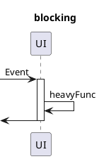
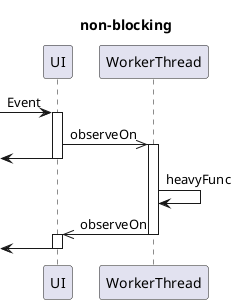

# 実践編

> Note: 文書中の図を正しく表示するためには**PlantUML**が必要です。

## GUIアプリケーションへの組み込み
### 実行スレッドとSchedulerの関係
GUIアプリケーションを作るためのツールキットの多くは、「UIに対する操作」をいわゆる「UIスレッド」で実行しなければならない、という制約があります。

これはイベントループの操作が公開されたフレームワークでよく見られる制約ですが、たとえば`WinForms`や`WPF`、D言語向けのライブラリでは`dlang-ui`などが該当する非常に一般的な制約です。

これを解決するためには、「処理がどのスレッドで実行されるか」という点を注意深く確認しながらコーディングする必要があり、非常に手間がかかります。

一方、rxにはこれを解決するための`Scheduler`というコンセプトがあります。

この`Scheduler`を正しく使えば、`subscribe`や`put`/`completed`/`failure`が実行されるスレッドを容易に切り替えることができます。


### Schedulerの目的
GUIアプリケーションにおける`Scheduler`の目的は、多くの場合「重い処理をUIスレッド外へ逃がす」「UIスレッドへ処理をディスパッチする」の2つです。

前者は、`subscribeOn`や`observeOn`といったオペレーターに対し、`TaskPoolScheduler`や`ThreadScheduler`を指定することで別スレッドで実行させることができます。これらは組み込みの機能だけで実現できるため、覚えてしまえば特に難しい点はありません。

後者は、ツールキット毎に専用の`Scheduler`を作ることで対応する必要があります。このためには、「ツールキットのイベントループを操作する方法」と「`Scheduler`が満たすべき要件」の両方を理解する必要があります。

> Note: 後者の役割を持った`Scheduler`は、多くの場合`Dispatcher`と呼ばれます。

### Dispatcherの作成例（dlang-ui）
Example（scheduler-dlangui）にて、`dlang-ui`向けの`Dispatcher`クラスを公開しています。

このクラスは、`dlang-ui`が公開している`Timer`クラスを使い、`put`で実行する処理をイベントループにディスパッチします。
これによって、`subscribe`した処理が常にUIスレッドで実行されるようになります。

### コード例
重い処理を「UIスレッドで行う場合」と「ワーカースレッドへ逃がす場合」について、それぞれ疑似コードを示します。

適切な`Dispatcher`クラスが定義されているとして、ブロッキングバージョンのロジックに`observeOn`をいくつか挟むだけで実行スレッドを切り替えることができることがわかります。

```d
auto sub = SubjectObject!int;

int heavyFunc(int n)
{
    // 重い処理
    return result;
}

auto blocking = sub
    .map!(&heavyFunc)
    .doSubscribe!(n => label.text = to!string(n));

auto nonBlocking = sub
    .observeOn(new ThreadScheduler)
    .map!(&heavyFunc)
    .observeOn(new MyDispatcher)
    .doSubscribe!(n => label.text = to!string(n));
```

これをシーケンス図で比較すると以下のようなイメージになります。





